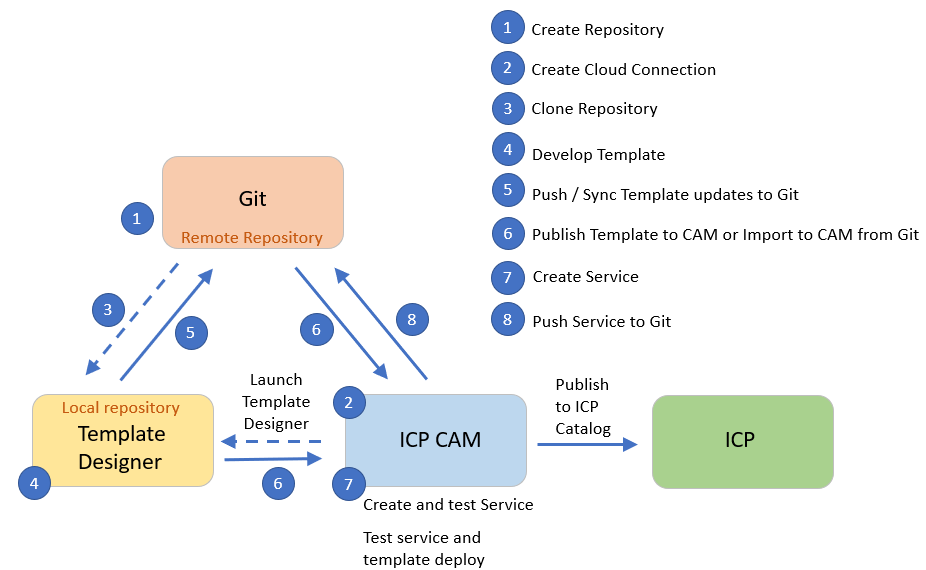

# cam-demo
Demonstrate IBM Cloud Automation Manager functionality to deploy orchestrated VMs to IBM PowerVC.

This project builds on the Proof of Technology described in “Deploying Oracle® Database as a Service with IBM Cloud PowerVC Manager" where we demonstrate how IBM Cloud PowerVC Manager (PowerVC) technology enables the implementation of Database-as-A-Service (DBaaS) for an Oracle® database. See sister project: [*powervc-oradbaas*](https://github.com/ppc64le/devops-automation/oracle/powervc-oradbaas)

In the first section we demonstrate how to utilize IBM Cloud Automation Manager (CAM), instead of (PowerVC), to provide the control point and end-user interface for DBaaS for an Oracle database, while re-using the existing PowerVC image developed in the sister project. The template related files for this part can be found in: *oradbaas*.

We then expand the scope and illustrate the workload orchestration capabilities of CAM by creating a deployable service which co-deploys two virtual machines (VM) - a database server and an application server. The result of that orchestrated deployment is a running and pre-loaded oracle database and a workload driver in the second VM ready for the end-user to connect to and drive simulated transactions against the database. The template related files for this part can be found in: *oraclient* and, for the service definition, in *oradbsc*.

Familiarity with IBM Cloud Private v3.2, IBM Cloud Automation Manager v3.2, IBM Power environment, IBM Power Virtualization Center (PowerVC), AIX and Linux system dministration is assumed. The creation of the deployable image for the Oracle database server, as described in *powervc-oradbaas*, requires working knowledge of Oracle 12c database software.

# Prerequisites
* Installed and working IBM PowerVC 1.3.1 or later install with IBM Power servers and PowerVC controlled storage
* Deployable Oracle DBaaS image in PowerVC and created as described in sister project powervc-oradbaas
* Installed ICP 3.2 on IBM Power
* Installed IBM Cloud Automation Manager 3.2.x
* NFS server to stage Oracle client and Swingbench software
* Linux on Power deployable image supported with Oracle Instant Client
    * See [Oracle Database Documentation](https://docs.oracle.com/en/database/oracle/oracle-database/index.html), select Oracle database release and then go to the _Install and Upgrade_ topic which includes a section for supported operating system releases for the Oracle Instant Client release.
    * We utilized Red Hat® Enterprise Linux Server 7.6 LE in our testing.

# How to get started
See __ICP_CAM_OraDBaaS.pdf__ for implementation details and step-by-step directions. If you do not yet have CAM installed see __CAM_INSTALL.pdf__ for a streamlined description of the CAM 3.2.1.2 install with NFS as used for this project.

The following figure illustrates the development steps of this project.

The next figure shows the result of the orchestrated deploy of *oradbaas* and *oraclient* from either CAM or ICP catalog.

