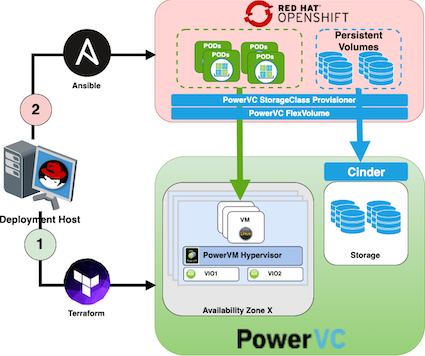

# OpenShift Container Platform 3.11 on PowerVC

Use this example to set up Red Hat® OpenShift Container Platform 3.11 on PowerVC.

## Overview

Deployment of 'OpenShift Container Platform on PowerVC' is a two steps process:

* **Step 1**: Provision the infrastructure on PowerVC <br>
  Use Terraform to provision the network, compute, storage on PowerVC.
  
* **Step 2**: Install OpenShift Container Platform <br>
  Use openshift-ansible playbooks to install OpenShift Container Platform (OCP) version 3.11

The following figure illustrates the deployment process for the 'OpenShift Container Platform on PowerVC'.



## Prerequisite

* RedHat Account with openshift subscription.
* Deployment Host/VM running terraform and openshift-ansible.
* PowerVC installed and configured.

## Steps for deploying the OpenShift Container Platform

### 1. Clone the repo [OpenShift Container Platform 3.11 on PowerVC](https://github.com/ppc64le/devops-automation.git):

```shell
# Clone the repo
git clone git clone https://github.com/ppc64le/devops-automation.git
cd devops-automation/powervc-openshift/
```

### 2. Deploy PowerVC infrastructure:

* Create terraform.tfvars file. There are 3 example files:
    
    - **terraform_aio.tfvars.example**      - All In One Deployment example This will create a network and 1xVM for Master-Infra-Worker(applications) Node.
    - **terraform_7nodes.tfvars.example**   - 7 Nodes Deployment example This will create a network, 3xVMs for Master-Infra Nodes, 3xVMs Workers(Applications) Nodes and 1xVM for LoadBalancer Node.
    - **terraform_10nodes.tfvars.example**  - 10 Nodes Deployment example This will create a network, 3xVMs for Master Nodes, 3xVMs for Infra Nodes, 3xVMs Workers(Applications) Nodes and 1xVM for LoadBalancer Node.


**Note:** Master, Inafra and Worker VMs has an additional disk (/dev/mapper/DOCKER_DISK_1) for dockervg.<br>
**Note:** If you want to use an existing network, you need to remove the network.tf file before applying the configuration.


* Deploy Infrastructure:

```shell
# initialize terraform a working directory
terraform init
# create an execution plan
terraform plan
# apply the changes required to reach the desired state
terraform apply
```

### 3. Install OpenShift Container Platform:

* Create ansible inventory file. There are 3 example files:
        
    - **aio.inv.example**       - This All-in-One (AIO) is not an officially supported OCP deployment. The AIO configuration is considered a testing or development environment. The Master, Infrastructure and Application Roles are deployed to a single node.
    - **7nodes.inv.example**    - 3x Master-Infra Nodes, 3x Workers (Application Nodes) and 1 Load Balancer (HAProxy) Node.
    - **10nodes.inv.example**   - 3x Master Nodes, 3x Infra Nodes, 3x Workers (Application Nodes) and 1 Load Balancer (HAProxy) Node.

**Note:** The HAProxy load balancer is intended to demonstrate the API server’s HA mode and is not recommended for production environments. 

* Register OpenShift VMs to the RHSM, attach pool ID and enable repositories:

```shell
# Check VM access:
ansible -i <inventory_file> nodes,lb  -m ping
# Register VMs to RHSM:
ansible -i <inventory_file> nodes,lb  -a 'subscription-manager register --username={{REGISTRY_SERVICE_ACCOUNT}}}} --password={{SERVICE_KEY}}'
# Attach POOL ID:
ansible -i  <inventory_file> nodes,lb -a 'subscription-manager attach --pool={{POOL_ID}}'
# Repository configuration for POWER9:
ansible -i  <inventory_file> nodes,lb -a 'subscription-manager repos --disable="*" --enable="rhel-7-for-power-9-rpms" --enable="rhel-7-for-power-9-extras-rpms" --enable="rhel-7-for-power-9-optional-rpms" --enable="rhel-7-server-ansible-2.6-for-power-9-rpms" --enable="rhel-7-server-for-power-9-rhscl-rpms" --enable="rhel-7-for-power-9-ose-3.11-rpms"'
```

* Prepare the VMs for OpenShift installation:

```shell
ansible-playbook -i <inventory_file> /usr/share/ansible/openshift-ansible/playbooks/prerequisites.yml
```

* Install OpenShift Container Platform:

```shell
ansible-playbook -i <inventory_file> /usr/share/ansible/openshift-ansible/playbooks/deploy_cluster.yml
```

## Steps for destroying the OpenShift Container Platform

* Unregister OpenShift VMs from the RHSM:

```shell
ansible -i  <inventory_file> nodes,lb  -a 'subscription-manager remove --all'
ansible -i  <inventory_file> nodes,lb  -a 'subscription-manager unregister'  
ansible -i  <inventory_file> nodes,lb  -a 'subscription-manager clean'
```

* Destroy PowerVC infrastructure:

```shell
terraform destroy
```
